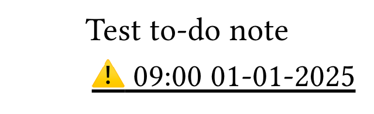

# Thermtypst

A bare-bones library for printing typst documents on thermal printers.

Check out `example/typst` to see an example template supporting multiple parameters, including flipping the note for upside-down printing.

## Example
To render the example note to file, do:

```
uv run example/render_to_file.py
```

and observe the output in `example.png` file:


Note that the example typst template is designed for 80mm paper, for 58mm printers you might want to tweak it. 